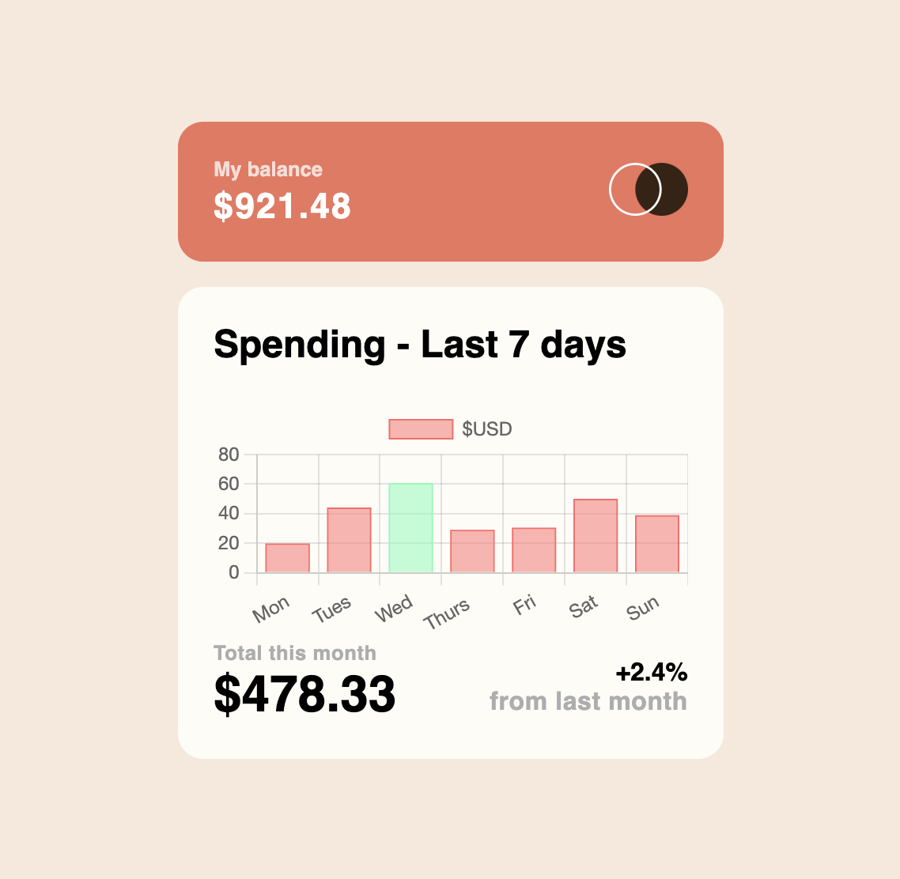
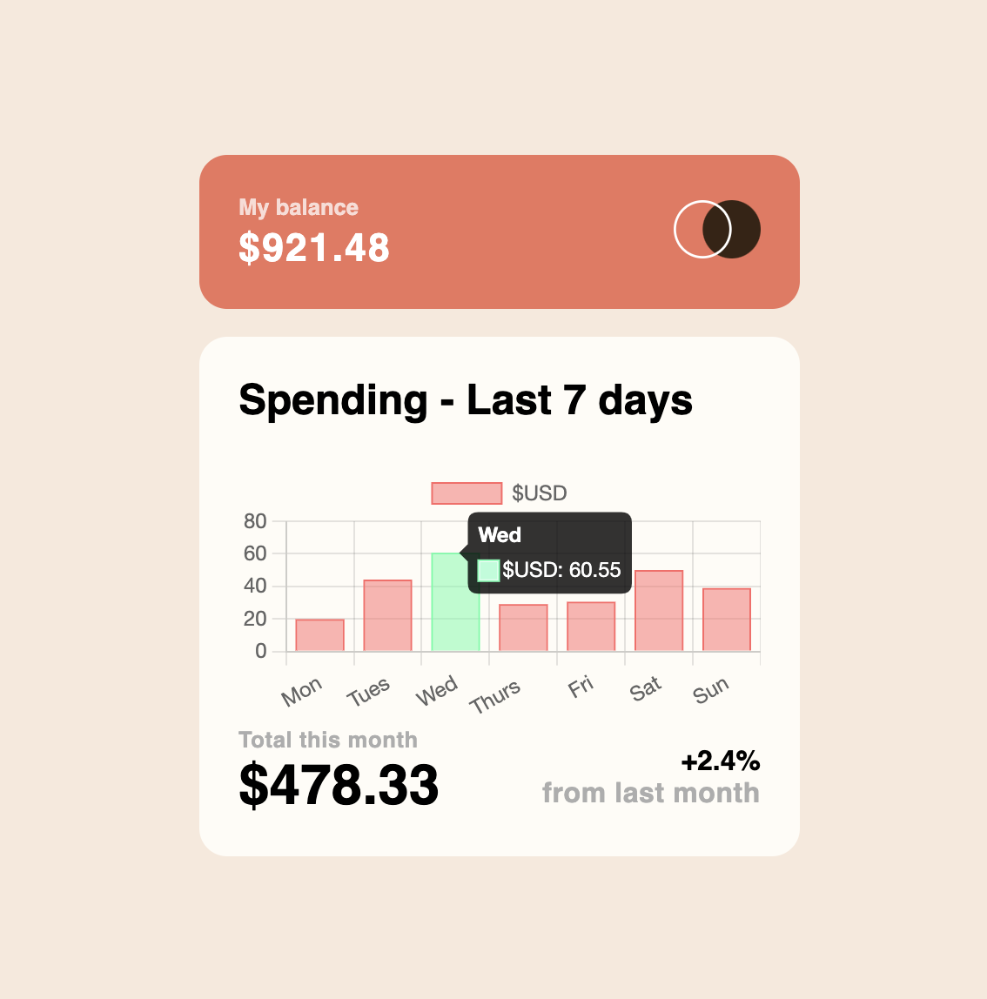

# Quiz 2 - Expenses chart page solution

This is a solution to the [Expenses-chart page Quiz 2 challenge]

## Table of contents

- [Overview](#overview)
  - [The challenge](#the-challenge)
  - [Screenshot](#screenshot)
  - [Links](#links)
- [My process](#my-process)
  - [Built with](#built-with)
  - [What I learned](#what-i-learned)
  - [Continued development](#continued-development)
  - [Useful resources](#useful-resources)
- [Author](#author)
- [Acknowledgments](#acknowledgments)

**Note: Delete this note and update the table of contents based on what sections you keep.**

## Overview
This website contains a bar chart representing the user's expenses for the past 7 days. When the user hovers over the bar of a certain day, it shows the amount they spent on said day. It also shows their current balance and the month's total expenses so far, as well as a percentage showing the difference with the previous month.

### The challenge

Users should be able to:

- View the bar chart and hover over the individual bars to see the correct amounts for each day
- See the current day's bar highlighted in a different colour to the other bars
- View the optimal layout for the content depending on their device's screen size
- See hover states for all interactive elements on the page
- **Bonus**: See dynamically generated bars based on the data provided in the local JSON file

### Screenshot




### Links

- Live Site URL: )

## My process

### Built with

- HTML
- CSS stylesheet
- chart.js Javascript

### What I learned

For this project, I mostly edited the HTML code rather than the CSS and Javascript. One thing I learned from this assignment is the implementation of Javascript scripts; in this case **chart.js**. I did not implement this script locally, rather I imported it from the internet, as seen below:

```
<script src="https://cdn.jsdelivr.net/npm/chart.js"></script>
```

I find that importing the script this way allows me to use the script in my code without having to download it into my machine. However importing the script this way does not allow me to edit the Javascript file itself, thus requiring me to manually input the data instead of pulling it from the JSON file. 

### Continued development

In the future, I plan to revise the code in a way that would allow me to import the data from the JSON file rather than inputting it directly into the HTML code. 

### Useful resources

- [Youtube Link](https://www.youtube.com/watch?v=hK4n-IpZ7iE) - I used this video to guide myself in completing this challenge.
- [Chart.js](https://www.chartjs.org/) - I used resources from the official chart.js website, including scripts and other guides that helped me in building the webpage.

## Your Detail 

- FullName - Ostein Vittorio Vellim
- StudentID - 2602206783
- BINUS Email - ostein.vellim@binus.ac.id

## Acknowledgments

I would like to thank the YouTube channel Irvine Mesa for his guide in completing this project. His video on the project is incredibly insightful in understanding the Javascript used to complete this assignment. I would also like to thank my friends for their feedback on my assignment. Without them I wouldn't have been able to complete this assignment.
